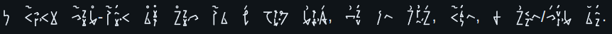
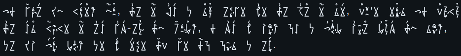
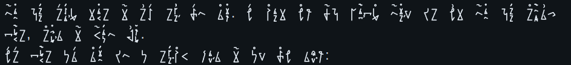
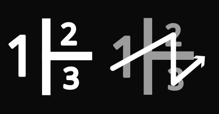

#  Norin

A compact mostly-phonetic writing system for the English Language, based on Japanese, Korean, and Saxon/Medieval Runes.

My purpose in creating Norin, was to have a writing script that was easy to write, didn't trigger my dyslexia, was very compact to save page-space when journaling, and gave the feeling of a magical fantasy language when reading, as if merely looking at the text would put you under a spell.

### Compactness

Norin uses several tricks to save space when writing. The first thing you probably noticed is that Norin uses sinogram blocks, similar to Korean Hangul.

These blocks are written in a specific order to aid with reading:

